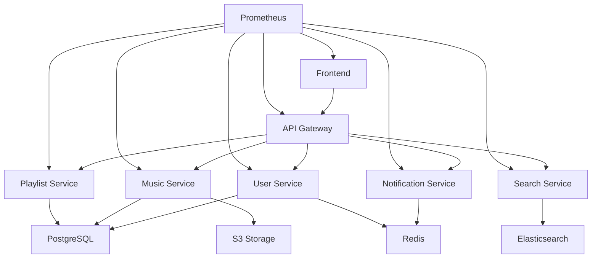

# 🎵 MoreMoreMusic Infrastructure Repository

> 오타쿠 중심 음악 스트리밍 플랫폼의 완전한 인프라 구성 및 개발 가이드

## 📋 목차

- [프로젝트 개요](#프로젝트-개요)
- [빠른 시작](#빠른-시작)
- [아키텍처 구조](#아키텍처-구조)
- [문서 가이드](#문서-가이드)
- [개발 환경 설정](#개발-환경-설정)
- [배포 방법](#배포-방법)
- [문제 해결](#문제-해결)

## 🎯 프로젝트 개요

**MoreMoreMusic**은 오타쿠 문화에 특화된 음악 스트리밍 플랫폼으로, 마이크로서비스 아키텍처(MSA)와 이벤트 드리븐 설계를 기반으로 구축되었습니다.

### 🎮 주요 기능
- **사용자 관리**: 회원가입, 로그인, 프로필 관리
- **음악 스트리밍**: 고품질 음악 재생, 플레이리스트 관리
- **추천 시스템**: AI 기반 개인화된 음악 추천
- **소셜 기능**: 플레이리스트 공유, 커뮤니티 기능
- **실시간 알림**: 이벤트 기반 실시간 사용자 알림

### 🛠️ 기술 스택
- **Frontend**: React 18, TypeScript, TailwindCSS
- **Backend**: Node.js, NestJS, TypeScript
- **Message Broker**: Apache Kafka (KRaft Mode)
- **Database**: PostgreSQL 15, Redis 7
- **Container**: Docker, Kubernetes
- **Orchestration**: Helm 3
- **CI/CD**: GitHub Actions

## 🚀 빠른 시작

### 전체 환경 설치 (5분 설치)

```bash
# 1. 저장소 클론
git clone https://github.com/Sekai-of-Code/MoreMoreMusic-infra-repo.git
cd MoreMoreMusic-infra-repo

# 2. 개발 환경 자동 설정 (Docker Desktop + Kubernetes 필요)
./scripts/quick-setup.sh

# 3. 상태 확인
kubectl get pods -n moremoremusic-msa
```

### 수동 설정 (세부 제어)

```bash
# 1. 네임스페이스 및 보안 설정
kubectl apply -f security.yaml

# 2. Kafka 브로커 배포
kubectl apply -f kafka.yaml

# 3. 서비스 배포 (선택사항)
kubectl apply -f services.yaml

# 4. 상태 확인
kubectl get all -n moremoremusic-msa
```

## 🏗️ 아키텍처 구조

### 전체 시스템 아키텍처
```
┌─────────────────────────────────────────────────────────────┐
│                    MoreMoreMusic Platform                    │
├─────────────────┬─────────────────┬─────────────────────────┤
│   Frontend      │  User Service   │    Music Service        │
│   (React App)   │   (NestJS)      │     (NestJS)           │
└─────────┬───────┴─────────┬───────┴─────────┬───────────────┘
          │                 │                 │
          │         ┌───────▼─────────────────▼───────┐
          │         │        Kafka Message Bus       │
          │         │     (Event-Driven Comm)        │
          │         └───────┬─────────────────────────┘
          │                 │
    ┌─────▼─────┐  ┌────────▼────────┐  ┌─────────────┐
    │  Ingress  │  │   PostgreSQL    │  │    Redis    │
    │ (nginx)   │  │ (Main Database) │  │   (Cache)   │
    └───────────┘  └─────────────────┘  └─────────────┘
```

### 메시지 플로우
```
User Action (로그인) → User Service → Kafka Topic (user-events) 
                                        ↓
Music Service ← Kafka Consumer ← [이벤트 수신]
     ↓
개인화된 추천 음악 준비 → 사용자에게 표시
```

### 주요 컴포넌트

| 컴포넌트 | 역할 | 포트 | 상태 |
|----------|------|------|------|
| **kafka-service** | 메시지 브로커 | 9092 | ✅ Running |
| **user-service** | 사용자 관리 | 3000 | 🚧 개발 중 |
| **music-service** | 음악 스트리밍 | 3001 | 🚧 개발 중 |
| **frontend** | 웹 인터페이스 | 80 | 📋 계획됨 |

## 📚 문서 가이드

### 📂 문서 구조
```
docs/
├── setup/                    # 환경 설정 가이드
│   └── development-environment.md
├── guides/                   # 개발 가이드
│   ├── kafka-communication.md
│   └── development-workflow.md
└── troubleshooting/          # 문제 해결
    └── debugging-guide.md
```

### 🎯 신규 팀원용 필수 문서
1. **[개발환경 설정 가이드](./docs/setup/development-environment.md)**
   - 시스템 요구사항부터 완전한 개발 환경 구축까지
   - Kubernetes, Helm, Docker 설정
   - 5분만에 따라할 수 있는 단계별 가이드

2. **[Kafka 통신 완전 가이드](./docs/guides/kafka-communication.md)**
   - Kafka 기초 개념부터 실전 구현까지
   - Producer/Consumer 예제 코드
   - 메시지 스키마 설계 및 성능 최적화

### 🔧 개발 및 운영용 문서
3. **[문제해결 및 디버깅 가이드](./docs/troubleshooting/debugging-guide.md)**
   - 자주 발생하는 문제와 해결방법
   - 5분 진단 체크리스트
   - 응급상황 대응 절차

4. **[개발 워크플로우 가이드](./docs/guides/development-workflow.md)**
   - Git 브랜치 전략
   - 코드 리뷰 가이드라인
   - CI/CD 파이프라인

### 📁 설정 파일 설명

| 파일명 | 용도 | 설명 |
|--------|------|------|
| `kafka.yaml` | Kafka 브로커 | KRaft 모드 Kafka 단일 브로커 설정 |
| `security.yaml` | 보안 설정 | NetworkPolicy, RBAC, ServiceAccount |
| `services.yaml` | 서비스 관리 | Pod Disruption Budget 설정 |
| `values-development.yaml` | 개발 환경 | 개발용 Helm 차트 값 |
| `values-production.yaml` | 프로덕션 환경 | 프로덕션용 Helm 차트 값 |

## 🚀 Deployment Guide

### Prerequisites
- Kubernetes cluster (1.25+)
- kubectl configured
- NGINX Ingress Controller
- cert-manager for SSL certificates
- Storage classes configured

### Quick Start

1. **Create namespaces**:
   ```bash
   kubectl apply -f k8s/namespaces.yaml
   ```

2. **Setup secrets** (replace template values):
   ```bash
   # Edit secrets template with actual values
   cp k8s/secrets/secrets-template.yaml k8s/secrets/secrets.yaml
   # Edit secrets.yaml with base64 encoded values
   kubectl apply -f k8s/secrets/secrets.yaml
   ```

3. **Deploy database layer**:
   ```bash
   kubectl apply -f k8s/database/
   kubectl apply -f k8s/cache/
   ```

4. **Deploy application services**:
   ```bash
   kubectl apply -f k8s/services/
   kubectl apply -f k8s/api-gateway/
   kubectl apply -f k8s/frontend/
   ```

5. **Setup ingress**:
   ```bash
   kubectl apply -f k8s/ingress/
   ```

6. **Deploy monitoring**:
   ```bash
   kubectl apply -f k8s/monitoring/
   ```

### Service Dependencies



## 🔧 Configuration

### Environment Variables
Each service requires specific environment variables. See individual deployment files for details.

### Resource Limits
- **Frontend**: 200m CPU, 256Mi-512Mi memory
- **API Gateway**: 500m-1000m CPU, 512Mi-1Gi memory
- **Services**: 200m-800m CPU, 256Mi-1Gi memory
- **Database**: 500m-1000m CPU, 1Gi-2Gi memory

### Auto-scaling
All services configured with Horizontal Pod Autoscaler:
- CPU threshold: 70%
- Memory threshold: 80%
- Min replicas: 2
- Max replicas: 4-8 (varies by service)

## 🔒 Security

### Authentication & Authorization
- JWT-based authentication via User Service
- Service-to-service communication secured with Istio mTLS
- RBAC configured for Kubernetes resources

### Secret Management
- Kubernetes Secrets for sensitive data
- Consider External Secrets Operator for production
- All secrets base64 encoded

### Network Security
- Network policies for pod-to-pod communication
- Ingress TLS termination with Let's Encrypt
- Private subnets for database and cache

## 📊 Monitoring & Observability

### Metrics
- Prometheus for metrics collection
- Custom application metrics exposed on `/metrics`
- Infrastructure and application monitoring

### Logging
- Centralized logging with ELK stack (optional)
- Structured JSON logging
- Log retention and rotation policies

### Health Checks
- Liveness probes for all services
- Readiness probes for traffic routing
- Custom health endpoints at `/health`

## 🛠️ Development

### Local Development
```bash
# Port forward services for local testing
kubectl port-forward svc/api-gateway-service 3000:3000
kubectl port-forward svc/postgresql-primary 5432:5432
kubectl port-forward svc/redis-primary 6379:6379
```

### Debugging
```bash
# View logs
kubectl logs -f deployment/api-gateway -n moremoremusic

# Execute shell in pod
kubectl exec -it deployment/api-gateway -n moremoremusic -- /bin/sh

# Check service endpoints
kubectl get endpoints -n moremoremusic
```

## 🔄 CI/CD Integration

### Image Build
- Container images should be tagged with semantic versioning
- Use multi-stage Dockerfiles for optimization
- Implement security scanning in build pipeline

### Deployment Strategy
- Blue-green or rolling updates
- Automated rollback on health check failures
- Database migration jobs before deployments

## 📈 Scaling Considerations

### Horizontal Scaling
- Stateless application design
- Load balancing across replicas
- Database read replicas for read-heavy workloads

### Vertical Scaling
- Resource requests and limits tuning
- JVM heap size optimization for services
- Database connection pool sizing

## 🆘 Troubleshooting

### Common Issues
1. **Pod not starting**: Check resource limits and secrets
2. **Service unreachable**: Verify service selectors and endpoints
3. **Database connection failed**: Check database service and credentials
4. **SSL certificate issues**: Verify cert-manager and Let's Encrypt setup

### Useful Commands
```bash
# Check pod status
kubectl get pods -n moremoremusic

# Describe problematic pods
kubectl describe pod <pod-name> -n moremoremusic

# Check service endpoints
kubectl get endpoints -n moremoremusic

# View recent events
kubectl get events -n moremoremusic --sort-by='.lastTimestamp'
```

## 🤝 Contributing

1. Follow Kubernetes best practices
2. Update resource requests/limits based on monitoring data
3. Test changes in staging environment first
4. Document configuration changes

## 📄 License

Private repository for MoreMoreMusic infrastructure.