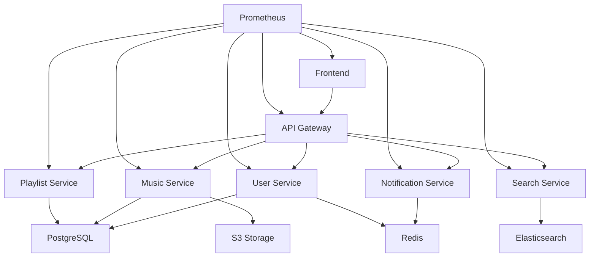

# MoreMoreMusic Infrastructure Repository

Kubernetes infrastructure configurations for MoreMoreMusic MSA deployment.

## 🏗️ Architecture Overview

### Microservices Architecture
- **Frontend Service**: React SPA with TypeScript
- **API Gateway**: NestJS-based routing and authentication
- **User Service**: User management and authentication
- **Music Service**: Music metadata and streaming
- **Playlist Service**: Playlist management
- **Search Service**: Music search and recommendations
- **Notification Service**: Real-time notifications

### Infrastructure Components
- **Ingress**: NGINX Ingress Controller with SSL/TLS
- **Database**: PostgreSQL cluster with replication
- **Cache**: Redis cluster for sessions and caching
- **Monitoring**: Prometheus + Grafana stack
- **Storage**: AWS S3 for media files
- **Service Mesh**: Istio (optional)

## 📁 Directory Structure

```
k8s/
├── namespaces.yaml              # Kubernetes namespaces
├── frontend/
│   └── deployment.yaml          # Frontend service deployment
├── api-gateway/
│   └── deployment.yaml          # API Gateway deployment
├── services/
│   ├── user-service.yaml        # User management service
│   ├── music-service.yaml       # Music streaming service
│   ├── playlist-service.yaml    # Playlist management
│   ├── search-service.yaml      # Search functionality
│   └── notification-service.yaml # Real-time notifications
├── database/
│   └── postgresql.yaml          # PostgreSQL cluster
├── cache/
│   └── redis.yaml               # Redis cache cluster
├── ingress/
│   └── ingress.yaml             # Ingress configuration
├── secrets/
│   └── secrets-template.yaml    # Secret templates
└── monitoring/
    ├── prometheus.yaml          # Prometheus monitoring
    └── grafana.yaml             # Grafana dashboards
```

## 🚀 Deployment Guide

### Prerequisites
- Kubernetes cluster (1.25+)
- kubectl configured
- NGINX Ingress Controller
- cert-manager for SSL certificates
- Storage classes configured

### Quick Start

1. **Create namespaces**:
   ```bash
   kubectl apply -f k8s/namespaces.yaml
   ```

2. **Setup secrets** (replace template values):
   ```bash
   # Edit secrets template with actual values
   cp k8s/secrets/secrets-template.yaml k8s/secrets/secrets.yaml
   # Edit secrets.yaml with base64 encoded values
   kubectl apply -f k8s/secrets/secrets.yaml
   ```

3. **Deploy database layer**:
   ```bash
   kubectl apply -f k8s/database/
   kubectl apply -f k8s/cache/
   ```

4. **Deploy application services**:
   ```bash
   kubectl apply -f k8s/services/
   kubectl apply -f k8s/api-gateway/
   kubectl apply -f k8s/frontend/
   ```

5. **Setup ingress**:
   ```bash
   kubectl apply -f k8s/ingress/
   ```

6. **Deploy monitoring**:
   ```bash
   kubectl apply -f k8s/monitoring/
   ```

### Service Dependencies



## 🔧 Configuration

### Environment Variables
Each service requires specific environment variables. See individual deployment files for details.

### Resource Limits
- **Frontend**: 200m CPU, 256Mi-512Mi memory
- **API Gateway**: 500m-1000m CPU, 512Mi-1Gi memory
- **Services**: 200m-800m CPU, 256Mi-1Gi memory
- **Database**: 500m-1000m CPU, 1Gi-2Gi memory

### Auto-scaling
All services configured with Horizontal Pod Autoscaler:
- CPU threshold: 70%
- Memory threshold: 80%
- Min replicas: 2
- Max replicas: 4-8 (varies by service)

## 🔒 Security

### Authentication & Authorization
- JWT-based authentication via User Service
- Service-to-service communication secured with Istio mTLS
- RBAC configured for Kubernetes resources

### Secret Management
- Kubernetes Secrets for sensitive data
- Consider External Secrets Operator for production
- All secrets base64 encoded

### Network Security
- Network policies for pod-to-pod communication
- Ingress TLS termination with Let's Encrypt
- Private subnets for database and cache

## 📊 Monitoring & Observability

### Metrics
- Prometheus for metrics collection
- Custom application metrics exposed on `/metrics`
- Infrastructure and application monitoring

### Logging
- Centralized logging with ELK stack (optional)
- Structured JSON logging
- Log retention and rotation policies

### Health Checks
- Liveness probes for all services
- Readiness probes for traffic routing
- Custom health endpoints at `/health`

## 🛠️ Development

### Local Development
```bash
# Port forward services for local testing
kubectl port-forward svc/api-gateway-service 3000:3000
kubectl port-forward svc/postgresql-primary 5432:5432
kubectl port-forward svc/redis-primary 6379:6379
```

### Debugging
```bash
# View logs
kubectl logs -f deployment/api-gateway -n moremoremusic

# Execute shell in pod
kubectl exec -it deployment/api-gateway -n moremoremusic -- /bin/sh

# Check service endpoints
kubectl get endpoints -n moremoremusic
```

## 🔄 CI/CD Integration

### Image Build
- Container images should be tagged with semantic versioning
- Use multi-stage Dockerfiles for optimization
- Implement security scanning in build pipeline

### Deployment Strategy
- Blue-green or rolling updates
- Automated rollback on health check failures
- Database migration jobs before deployments

## 📈 Scaling Considerations

### Horizontal Scaling
- Stateless application design
- Load balancing across replicas
- Database read replicas for read-heavy workloads

### Vertical Scaling
- Resource requests and limits tuning
- JVM heap size optimization for services
- Database connection pool sizing

## 🆘 Troubleshooting

### Common Issues
1. **Pod not starting**: Check resource limits and secrets
2. **Service unreachable**: Verify service selectors and endpoints
3. **Database connection failed**: Check database service and credentials
4. **SSL certificate issues**: Verify cert-manager and Let's Encrypt setup

### Useful Commands
```bash
# Check pod status
kubectl get pods -n moremoremusic

# Describe problematic pods
kubectl describe pod <pod-name> -n moremoremusic

# Check service endpoints
kubectl get endpoints -n moremoremusic

# View recent events
kubectl get events -n moremoremusic --sort-by='.lastTimestamp'
```

## 🤝 Contributing

1. Follow Kubernetes best practices
2. Update resource requests/limits based on monitoring data
3. Test changes in staging environment first
4. Document configuration changes

## 📄 License

Private repository for MoreMoreMusic infrastructure.